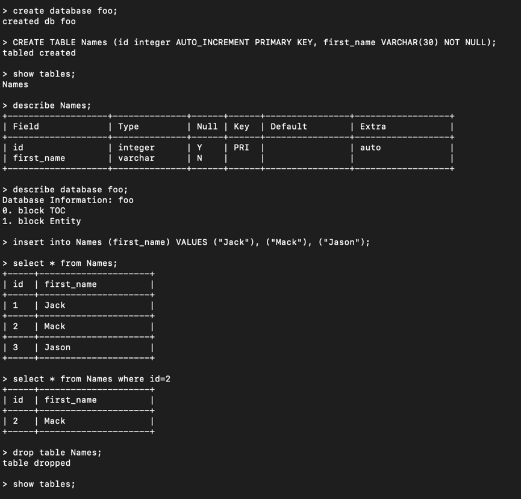
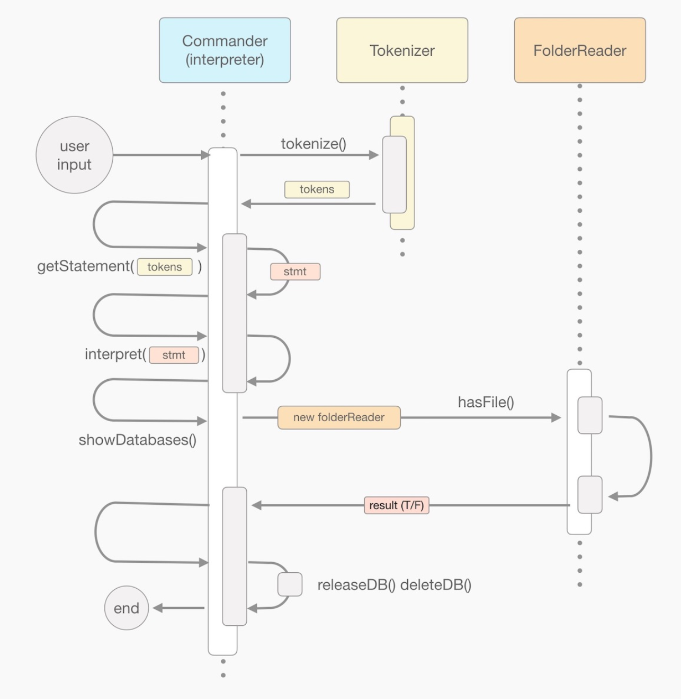

# Relational Database Management System

### A quick view of the test sample:
   

### The flow chart of dropping a database:
   

## A relational database management system which can be managed by SQL commands  

This project acts like a real MySQL database system that can process SQL commands. You can create/drop databases and the program will encode the data and store it in the local machine. When you need to view the data, simply use the exact same commands in SQL by typing in "SELECT * FROM Database1" and the program will display the data in the terminal in a form.   

### Tokenizer, RGTokenizer  
Used for tokenize the command input into tokens. There are mainly three kinds of commands that need to be tokenized;
1. Meta-commands that control the system, such as the `Quit` command which terminates the app. 
2. Database-level commands (like "Create database xxx", or "Show databases")
3. Data-oriented commands (like "Create table...", "Show tables", "insert (...) into tablename", ...)  
     
### Statement, SQLStatement, DBStatement  
1. Statement is the basic abstract class of SQLStatement and DBStatement.  
2. The tokenizer parse the commands into SQLStatement or DBStatement based on the keywards.  
3. The statement will be routed to specific command processor for processing the command. 
 
 
### CommandProcessor, DBManager, SQLInterpreter  
Used for processing different command.
1. Used the chain-of-responsibility pattern, handle the control to the next processor.
2. CommandProcessor processes the commands like "quit", "version", "help".
3. DBManager processes the database-related commands like "create/delete database db". 
4. SQL processes the data-related commands like "select/update/delete records".

### Block, Row
Storage class for storing data.
1. Row class is the storage class for each row in the table. It can be encoded to a block.
2. Storage class is the class for storing the whole table. Different kinds of data will be encoded into appropriate data type for storing in a local file.

### EntityDescriptionView, RecordsView, BlockVisitor
Used for display the data in the terminal to users.
1. BlockVisitor is a helper class, used for visiting all the blocks in the storage memory. It will retrieve the blocks if it satisfies a specific condition.
2. EntityDescriptionView and RecordsView use the BlockVisitor to get the data from the memory and display it in the terminal.
